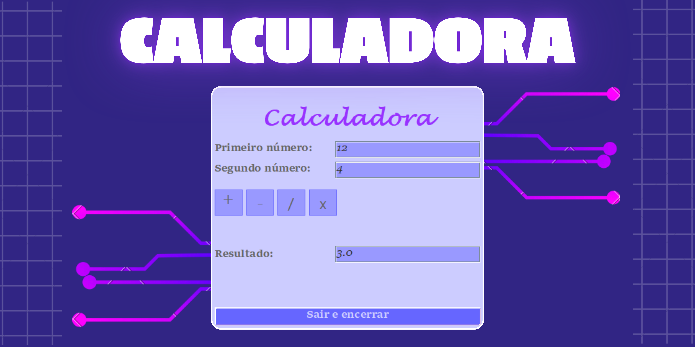

# Calculadora

Calculadora base, simples e prática, iniciação do "form", ou Interface, no Java.

## :thought_balloon: Visão Geral

Projeto simples utilizando Java para realizar as quatro operações com apenas duas grandezas.

## :rocket: Tecnologias Utilizadas

- Java
- Git e Github

## :speech_balloon: Instruções de Instalação

Instale o `Apache NetBeans` e o `Java` em seu computador. Com isso, faça o download do arquivo.

## :grey_question: Como Usar

Após a instalação e configuração, vá em `Open Project` dentro do NetBeans e abra o aequivo instalado.

## :grey_exclamation: Estrutura de Arquivos
├── CalculadoraBase_UI

├── Source Packages

├── default package

└── CalculadoraForm.java

## :love_letter: Contribuição

Contribuições são sempre bem-vindas!

## :v: Créditos

Feito com muito ♥ by Julia Faria :wave: